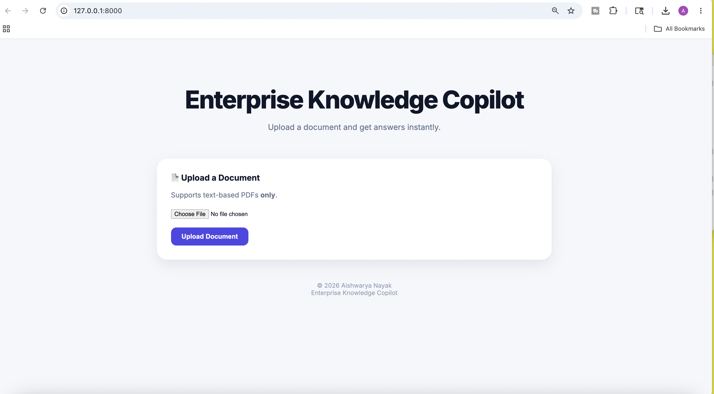
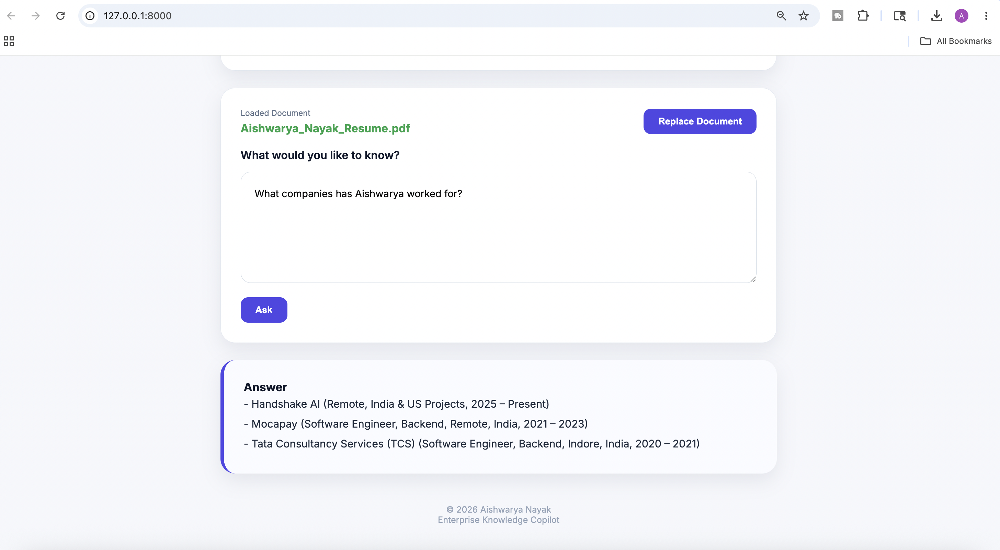
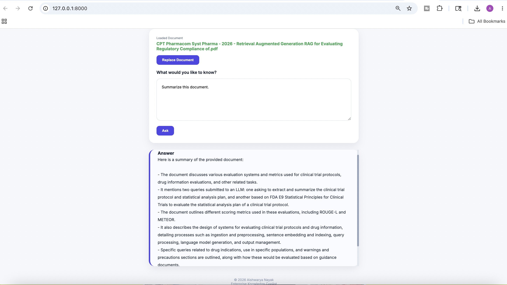

# Enterprise Knowledge Copilot

A Retrieval-Augmented Generation (RAG) application that enables users to upload PDF documents and ask natural-language questions about their content. The system combines semantic search with a locally hosted Large Language Model (LLM) to provide context-aware answers while keeping all data processing on the user's machine.

---

## Overview

Enterprise Knowledge Copilot helps users quickly extract information from large documents without manually searching through pages.

After a document is uploaded, the application:

1. Extracts text from the PDF.
2. Splits the content into semantic chunks.
3. Generates vector embeddings using Sentence Transformers.
4. Stores embeddings in ChromaDB.
5. Retrieves the most relevant chunks for a user's question.
6. Sends the retrieved context to a local LLM through Ollama.
7. Returns a concise answer grounded in the document content.

The entire workflow runs locally, ensuring privacy and eliminating dependency on external APIs.

---

## Screenshots

### Upload Interface



### Question Answering



### Document Summarization



---

## Features

### Document Upload

* Upload PDF documents through a clean web interface.
* Automatically processes and indexes content for retrieval.

### Semantic Search

* Uses vector embeddings to retrieve relevant information based on meaning rather than keyword matching.

### Context-Aware Question Answering

* Answers questions using retrieved document context.
* Reduces hallucinations by grounding responses in source content.

### Local LLM Inference

* Powered by Ollama and Qwen.
* No OpenAI API keys or cloud services required.

### Responsive User Interface

* Clean and modern interface.
* Mobile, tablet, and desktop friendly.

### Fast Retrieval Pipeline

* ChromaDB vector database for efficient similarity search.
* Optimized for quick response times on local hardware.

---

## System Architecture

```text
User Question
      │
      ▼
Retrieve Relevant Chunks
      │
      ▼
ChromaDB Vector Search
      │
      ▼
Top Matching Chunks
      │
      ▼
Prompt Construction
      │
      ▼
Qwen (Ollama)
      │
      ▼
Generated Answer
```

---

## Tech Stack

### Backend

* FastAPI
* Python

### Retrieval Layer

* ChromaDB
* Sentence Transformers
* all-MiniLM-L6-v2

### LLM Layer

* Ollama
* Qwen 2.5 3B

### Frontend

* HTML
* CSS
* JavaScript
* Jinja2 Templates

### Document Processing

* PyPDF

---

## Project Structure

```text
enterprise-knowledge-copilot/
│
├── templates/
│   └── index.html
│
├── uploads/
│
├── data/
│   └── chroma/
│
├── app.py
├── llm.py
├── vector_services.py
├── search.py
├── chunk.py
├── pdf_parser.py
├── requirements.txt
└── README.md
```

---

## Installation

### Clone Repository

```bash
git clone <repository-url>
cd enterprise-knowledge-copilot
```

### Create Virtual Environment

```bash
python -m venv venv
source venv/bin/activate
```

### Install Dependencies

```bash
pip install -r requirements.txt
```

### Install Ollama

Download and install Ollama:

https://ollama.com

Pull the required model:

```bash
ollama pull qwen2.5:3b
```

### Start Ollama

```bash
ollama serve
```

### Run Application

```bash
uvicorn app:app --reload
```

Open:

```text
http://127.0.0.1:8000
```

---

## Example Questions

### Resume

* What technologies does the candidate know?
* Summarize the candidate's experience.
* What AI-related experience does the candidate have?
* Where does the candidate currently work?

### Tax Documents

* Summarize this document.
* What deductions are available?
* What tax credits are mentioned?
* What sections require special attention?

### Research Papers

* Summarize the key findings.
* What methodology was used?
* What are the limitations?
* What future work is suggested?

---

## Current Limitations

The current version focuses on accurate document-grounded question answering.

Known limitations include:

* Supports text-based PDFs only.
* Limited support for scanned documents without OCR.
* Single-document workflow.
* No conversational memory across questions.
* No source citations displayed in the UI.
* Long answers may require scrolling within the answer container.
* Dynamic reasoning tasks may not always perform reliably when the answer requires significant interpretation beyond the document content.

Example:

```text
"What improvements should be made to this resume for an AI Engineer role?"
```

Such questions require career reasoning and resume critique rather than direct retrieval from document content.

---

## Future Improvements

### OCR Support

Enable processing of scanned PDFs using OCR pipelines such as Tesseract.

### Multi-Document Retrieval

Search across multiple uploaded documents simultaneously.

### Source Citations

Display page numbers and source chunks used to generate answers.

### Conversational Memory

Allow follow-up questions without reintroducing context.

### Hybrid Search

Combine semantic retrieval with keyword search for improved accuracy.

### Streaming Responses

Generate answers token-by-token for a more interactive experience.

### Advanced Document Intelligence

Support higher-level reasoning tasks such as:

* Resume reviews
* Contract analysis
* Research paper critique
* Compliance checks
* Recommendation generation

### Authentication and User Workspaces

Allow users to maintain separate document collections and chat histories.

---

## Why This Project Matters

Traditional document search relies on exact keyword matching, forcing users to manually sift through large amounts of information.

Enterprise Knowledge Copilot demonstrates how Retrieval-Augmented Generation (RAG) can transform document interaction by combining semantic retrieval with modern language models, enabling users to ask questions naturally and receive contextual answers instantly.

The project showcases practical skills in:

* Retrieval-Augmented Generation (RAG)
* Vector Databases
* Embedding Models
* LLM Integration
* FastAPI Development
* Semantic Search Systems
* End-to-End AI Application Engineering

---

## Author

**Aishwarya Nayak**

AI Engineer | LLM Evaluation | Generative AI Systems

Built as a hands-on project to explore Retrieval-Augmented Generation (RAG), semantic search, and local LLM-powered knowledge systems.
